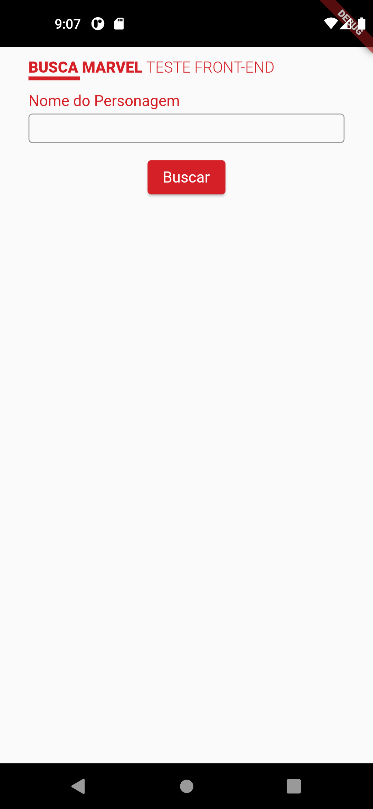
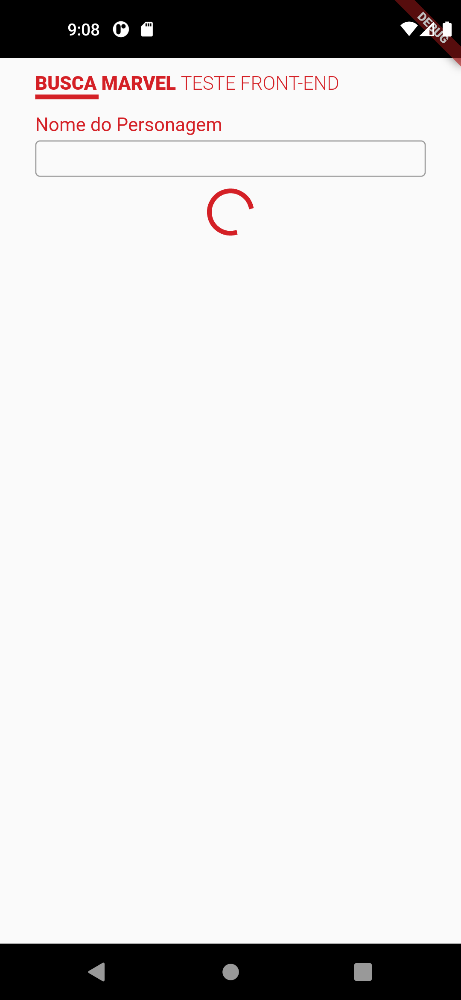
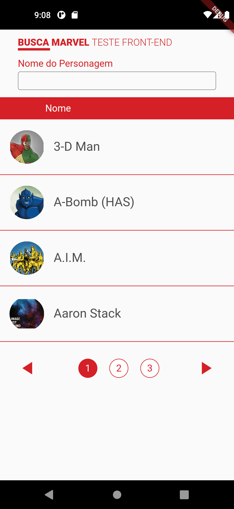
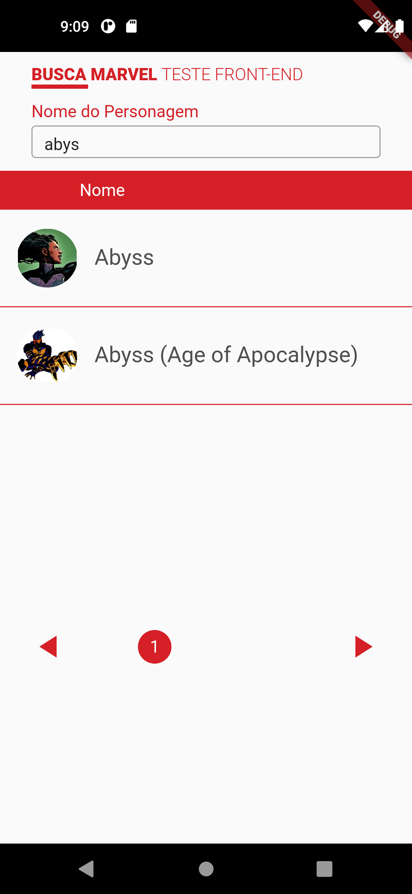
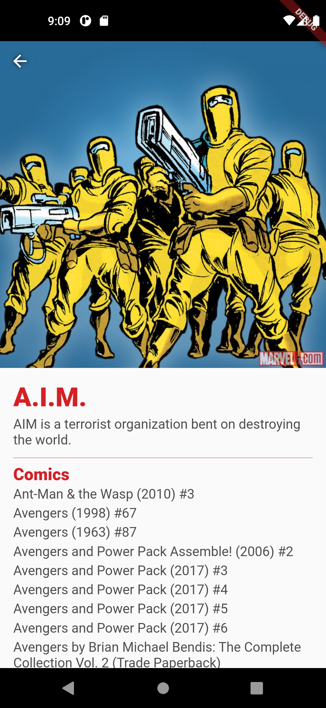

# marvel_hero_api

Flutter project build using Marvel's Hero API

This project was build using the packages:

- http;
- dartz;
- flutter_bloc;
- get_it;

# Screenshots

## Initial Page

## Loading Page

## Results Page 1

## Results Page 2

## Filter Results

## Details Page

